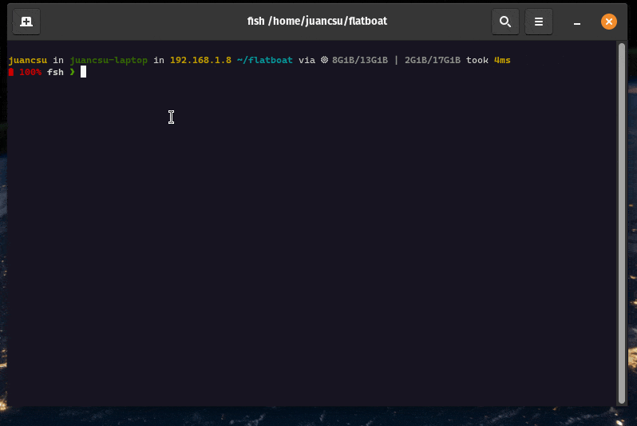
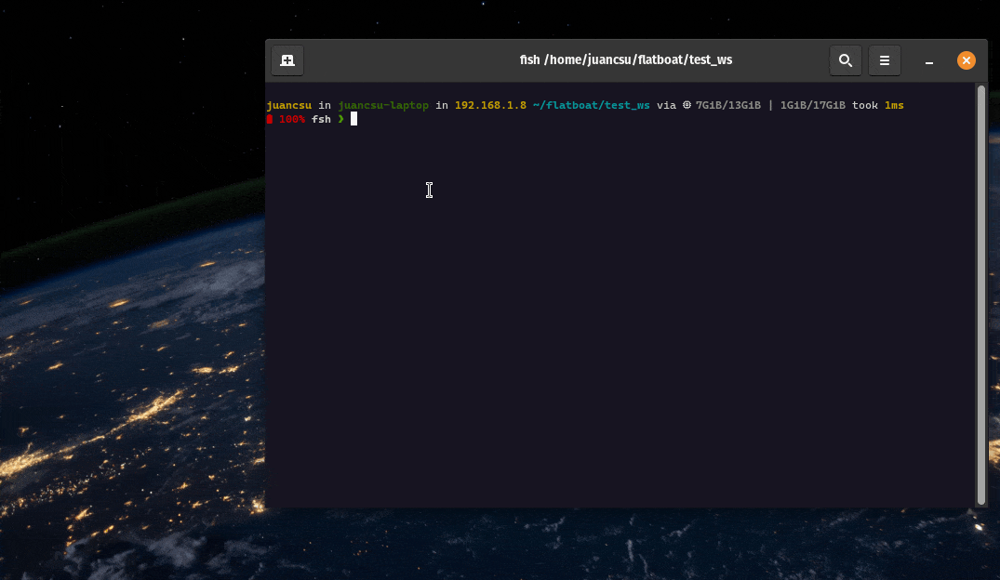
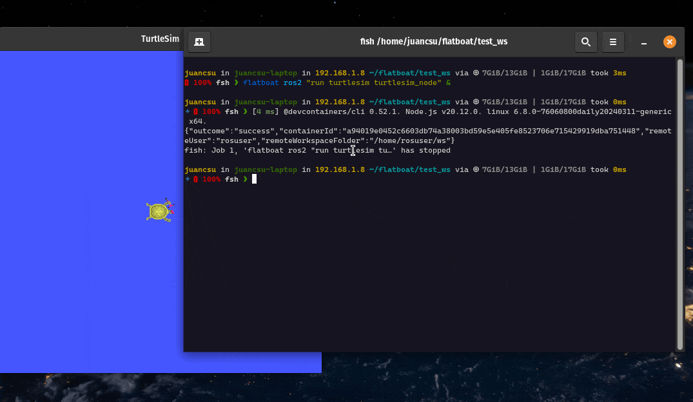
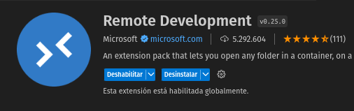
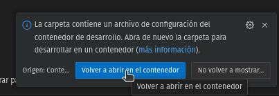

# Create a ROS2 Container Workspace

## Prerequisites

It is required to have Flatboat following [Install Section](../../02-install.mdx).

## Steps

### Run the Flatboat Command

```bash
flatboat workspace create ws_name
```

:::warning
This command may change in a near future!
:::



### Use the Workspace

#### Start Nodes with Flatboat ROS2

For example, you can run turtlesim on the created environment:

```bash
flatboat ros2 "run turtlesim turtlesim_node"
```

:::warning
This command may change in a near future!
:::



```bash
flatboat ros2 "run turtlesim turtle_teleop_key"
```



#### Open Devcontainer in VSCode

1. Make sure you have *Remote Development* extensions installed:



2. Open the workspace in VSCode with the following command, inside the workspace folder:

```bash
code .
```

3. Click on re-open


